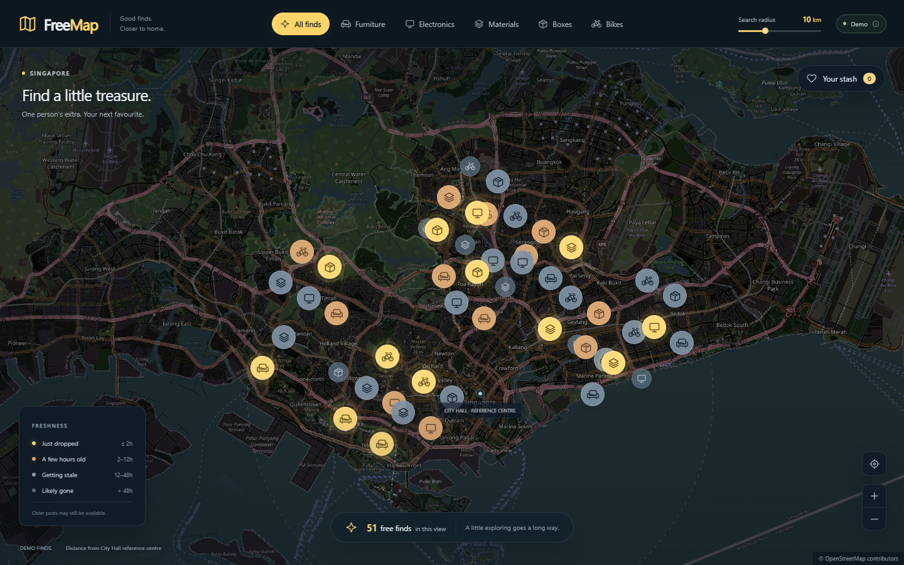
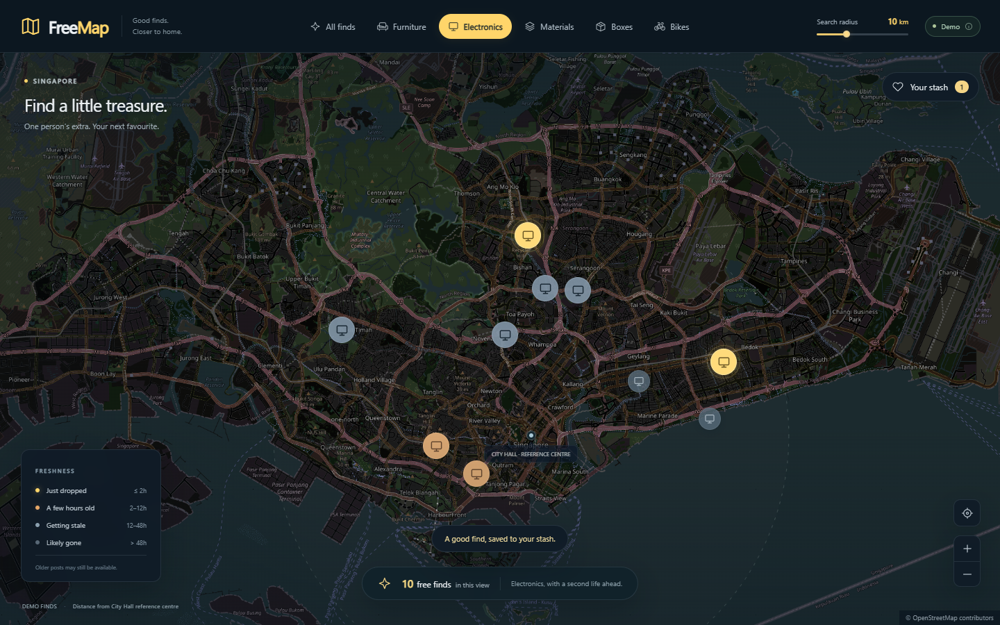
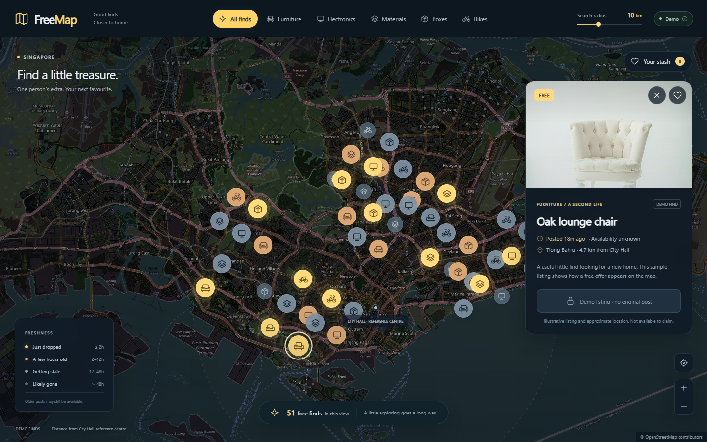
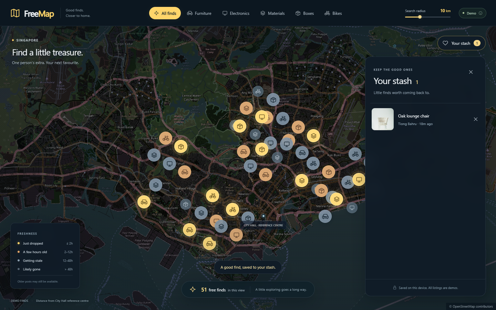
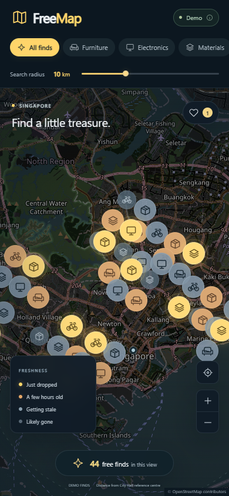

# FreeMap

## A Location-Based Interface for Discovering Free Second-Hand Items

FreeMap 是一个以地图为核心的免费二手物品发现原型。项目将位置、距离、发布时间和类别放在同一个空间界面中，让用户先观察物品分布，再查看详情和收藏。

| Project | Current version |
| --- | --- |
| Status | Functional prototype |
| Location | Singapore |
| Dataset | 60 fictional listings |
| Platform | Responsive web |
| Scope | Interaction design and front-end implementation |

当前版本使用演示数据，没有连接真实交易平台。距离以新加坡 City Hall 为固定参考点计算，不读取用户定位。本文记录设计思路、已实现行为与技术取舍；没有开展用户研究，也没有以原型测试替代真实使用效果评估。

[项目入口](README.md) · [开发与运行说明](docs/development.md)

项目目前为私有，公开演示已关闭；本地预览仍可使用。

## 01. Problem

### Background

项目从一个浏览场景出发：用户寻找免费家具或生活用品时，需要同时理解物品是什么、在哪里、发布了多久。列表能呈现标题和照片，但比较多个物品的空间关系往往需要反复查看地址或打开地图。

免费赠送信息还涉及状态变化。一个较早发布的帖子可能仍然有效，也可能已经失效；仅凭发布时间无法确认领取状态。因此，界面需要展示时间线索，同时保留“是否可领取尚不确定”的边界。

这些是本项目的设计假设，尚未通过用户访谈或与现有产品的对照研究验证。

### Design question

**如何让用户在同一个视图中理解免费物品的位置、距离与信息新鲜度，并继续查看值得关注的物品？**

| 用户问题 | 原型中的表达 |
| --- | --- |
| Where? | 地理位置、区域名称与地图标记 |
| How far? | 距 City Hall 参考中心的公里数与范围筛选 |
| How fresh? | 发布时间、四级新鲜度与视觉强调 |

地图承担主要浏览任务，详情面板提供进一步判断所需的信息。

## 02. Concept

### A digital treasure map

FreeMap 把免费物品组织成城市地图上的可探索节点。用户可以观察分布、缩小类别与范围，然后打开一个具体物品，保留感兴趣的发现。

主要流程为：

**Filter → Explore → Inspect → Save**

这套流程不要求用户先输入明确的商品名称，适合从“附近有哪些可用物品”开始探索。

### Design principles

- **Spatial first.** 首屏展示地理分布，详细文字在选择物品之后出现。
- **Progressive disclosure.** 标记只呈现类别与新鲜度；照片、标题、区域和距离放在详情中。
- **Time with uncertainty.** 时间用于提示信息可能过时，不用于断言物品已被领取。
- **Keep the map in context.** 分类切换、详情和收藏均发生在当前页面，关闭面板后继续浏览。

## 03. Visual Design

### Direction and reference

项目以参考视频中的 FreeMap 成品界面为复刻起点，再将默认地区换为新加坡，并补充演示数据标识、移动布局与失败状态。它是基于参考的实现练习，未将原视频的视觉构思宣称为独立原创设计。

视觉结构分为三层：地理底图、物品标记、浮动控件。底图整体压暗，保留道路和海岸线；新发布的物品使用暖黄色光晕；筛选、详情和收藏使用深色面板。

### Color system

| Role | Treatment |
| --- | --- |
| Page and panels | 深蓝、炭灰与轻微透明度 |
| Map | 低饱和深色地理底图 |
| Primary accent | 暖黄色 `#FFD56A` |
| Recent items | 琥珀色 `#E5A667` |
| Older items | 灰蓝色与降低的亮度 |
| Text | 浅色主文字与灰色辅助信息 |

暖黄色同时用于当前分类、最新点位和收藏反馈。较旧点位降低视觉强调，但仍可查看。

### Interface structure

桌面端顶部包含品牌、分类、搜索半径和 Demo 标识。地图上方是地区说明与收藏入口，下方放置新鲜度图例、可见数量、缩放与回到默认视野的按钮。详情和收藏从右侧展开。

### Categories

实际实现的入口为 **All finds、Furniture、Electronics、Materials、Boxes、Bikes**。All finds 表示全部类别，其余五个入口直接控制当前地图上的点位。

### Freshness

| State | Age | Visual treatment |
| --- | --- | --- |
| Just dropped | ≤ 2 hours | 暖黄点位与柔和光晕 |
| A few hours old | > 2–12 hours | 琥珀色点位 |
| Getting stale | > 12–48 hours | 灰蓝色点位 |
| Likely gone | > 48 hours | 暗灰色、降低强调 |

这些阈值是原型设计参数，没有经过领取数据验证。“Likely gone”仅表示可能过时，详情仍将可领取状态显示为未知。

## 04. Interaction

### Explore and filter

用户可以拖动和缩放地图。分类与搜索半径共同决定哪些物品生成标记，地图边界进一步决定底部的可见数量。地图移动不会改变 City Hall 参考中心，也不会暗中改变搜索半径。

范围滑条支持 **1–30 km**，默认 **10 km**。拖动时立即更新数值，结束拖动后应用筛选。筛选结果为空时显示重置入口；被筛掉的选中物品会关闭详情。

### Inspect an item

悬停标记显示简短标题与时间，点击后打开详情卡，包含图片或类别替代图、标题、类别、发布时间、区域与距参考中心的距离。关闭卡片时保留地图视野。

演示条目的原帖地址为空，来源按钮明确禁用。示意图片和近似位置不会被描述为真实可领取物品。

### Save a find

点击爱心会同步更新详情、地图标记、收藏数量与收藏列表。收藏保存物品 ID，刷新后恢复；移除最后一条收藏后显示空状态。

收藏仅保存在当前浏览器，不需要账号，也不支持跨设备同步。如果浏览器拒绝存储，界面会说明收藏仅对本次访问有效。

### Mobile and keyboard interaction

手机端将分类改为横向滚动，将详情和收藏改为底部面板。范围控件保持可见，打开面板时收起容易与之重叠的地图浮层。

 

标记支持 Enter 和空格激活，Escape 关闭详情或收藏，关闭详情后焦点返回对应标记。图标按钮有可读名称，减少动态效果偏好会关闭呼吸动画和惯性平移。点位密集时可放大地图或按类别筛选。

## 05. Technical Architecture

### Stack and modules

前端使用 HTML、CSS 和原生 JavaScript 模块。Leaflet 负责地理地图交互，OpenStreetMap 提供在线底图，LocalStorage 保存收藏。Node.js 仅用于本地静态预览服务和逻辑测试，网站本身可以作为静态页面托管。

| Module | Responsibility |
| --- | --- |
| `src/app.js` | 状态、地图初始化、事件处理与界面更新 |
| `src/core.js` | 距离、筛选、新鲜度、收藏校验与安全来源链接 |
| `src/data.js` | 演示物品、位置、类别及时间信息 |
| `src/icons.js` | 分类、标记与控件的 SVG 图标 |
| `styles.css` | 视觉样式、响应式布局和减少动态效果规则 |

### Data flow

**Demo listings → Category + radius filters → Map markers → Viewport count**

选择标记后，通过物品 ID 获取数据并渲染详情；收藏状态独立保存，不因地图筛选而丢失。纯逻辑函数与界面分离，便于单独测试。

### Distance and time

距离计算采用 Haversine 公式，以经纬度求球面距离。这里显示的是直线距离，不是步行路线或预计用时。

演示数据的时间基准在首次访问时生成并保存。刷新页面不会把所有物品重新变为“刚发布”；新鲜度依据当前时间重新计算。该机制用于演示状态变化，不代表真实平台的更新时间。

### Storage and recovery

读取收藏时过滤重复和不存在的 ID；数据损坏时恢复为空集合。图片缺失时显示带说明的类别图形。地图瓦片加载失败时显示重试入口，同时保留已加载的物品数据与收藏操作。

## 06. Implementation and Validation

实现从地图与演示数据开始，逐步接入类别和半径筛选、详情、收藏，再补充移动端及失败状态。视觉检查过程中发现首选底图返回 API Key 占位图，因此更换了可正常显示的地图源，并检查了道路、海岸与地名的实际画面。

键盘检查发现地图标记的 Enter 激活不稳定，随后补充了显式键盘处理；减少动态效果模式也关闭了惯性平移。

| Validation | Result and scope |
| --- | --- |
| Core logic | 5 项通过：距离、组合筛选、新鲜度边界、存储恢复、演示与来源链接边界 |
| Browser checks | 13 项通过：详情、收藏持久化、筛选、空结果、地图操作、弹窗、响应式布局与失败恢复等 |
| Viewports | 1440 × 900、1280 × 800、390 × 844 |
| Dataset | 60 条；默认 10 km 范围内 51 条，当前地图视野数量另行计算 |

[浏览器检查记录](screenshots/test-report.json)保留了通过项目。交互测试初始检查真实底图，后续使用模拟瓦片，避免重复请求额外地图区域；展示截图使用实际底图拍摄。

这些检查验证了特定环境中的功能与布局，不代表完整无障碍审计、跨浏览器兼容性认证或用户可用性研究。

## 07. Result and Limitations

当前原型支持完整的“浏览地图—筛选—查看—收藏—继续探索”流程，也能在刷新后恢复收藏。项目展示了以位置、距离和时间组织二手物品信息的一种实现方式。

尚未验证地图界面是否比列表更快帮助用户找到合适物品。下一步需要通过真实任务对比，以及不同点位密度下的可用性测试，判断这种信息组织方式的实际效果。

当前限制包括：

- 数据为虚构示例，坐标为近似位置，照片为示意素材。
- 未接入真实帖子、领取状态或发布后台。
- 不读取用户定位，所有距离使用固定参考点。
- 收藏只在当前浏览器保存。
- 底图需要联网；高密度点位仍需要缩放或筛选。

## 08. Future Work

优先补齐真实数据和状态可信度，再考虑扩展探索功能。

1. **Real listings.** 接入有明确访问方式的数据来源，完成字段映射、去重、坐标精度标注和更新时间记录。
2. **Availability.** 区分可领取、已领取、撤下与未知状态，减少对时间推测的依赖。
3. **User location.** 在用户主动允许后，以当前位置设置参考中心，并保留手动选择。
4. **Search and density.** 增加关键词搜索，评估聚合标记或可见物品列表，改善密集区域的点选。
5. **Community contribution.** 探索拍照、选择地点、发布和更新状态的流程。
6. **Evaluation.** 通过找物品任务比较地图与列表的完成时间、错误与理解成本。

推荐系统和更复杂的时间动画可以后续探索，不作为当前版本已实现的能力。

---

[返回项目入口](README.md) · [开发、测试与资源说明](docs/development.md)
